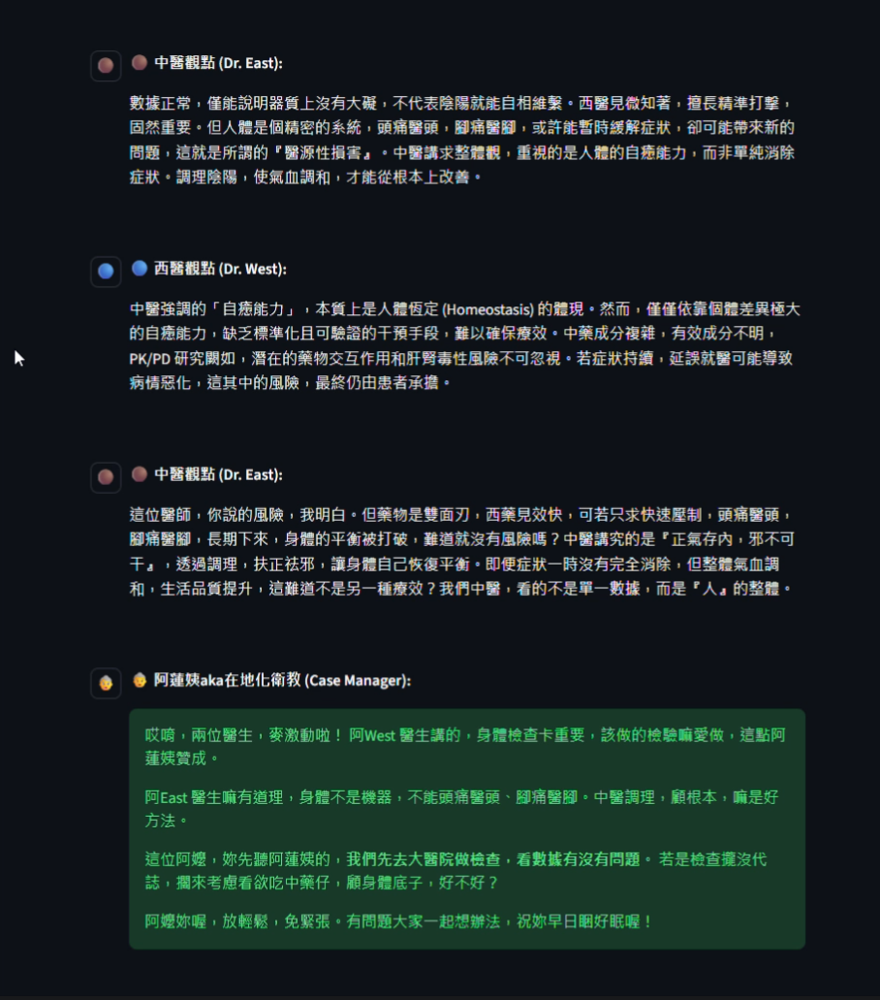

# ⚕️ Medical-Dialectic-Engine
### 中西醫觀點辯證引擎 | AI Multi-Agent System


> **"Bridging the Gap" —— 用 AI 彌合實證醫學與傳統中醫的認知鴻溝。**
>
> **"Code is bricks, system architecture is space. I build a digital buffer zone for peace of mind."**

## 📖 專案願景 (Vision)
在資訊爆炸的時代，生病的時候往往面臨 **"The Dr. Google Effect"** —— 網路上充斥著相互矛盾的醫療資訊，從 PTT 的「沒救了」到鄰居的「吃這個有效」，讓人無所適從。

**Medical-Dialectic-Engine (MDE)** 不是另一個只給標準答案的聊天機器人。它模擬了一場 **「西醫專家」** 與 **「中醫世家」** 的即時會診，透過觀點的 **辯證 (Dialectic)**，協助使用者從混亂 (Chaos) 走向清晰 (Clarity)。

## 🛠️ 系統架構 (System Architecture)
本系統採用 **LangChain 多智能體 (Multi-Agent)** 協作架構，並具備 **Model Agnostic** 特性，支援 Google Gemini, Groq (Llama 3), DeepSeek 等多種 LLM。

## 🧠 核心技術與模型策略 (Core Tech & Model Strategy)

本系統不依賴外部資料庫 (RAG)，而是透過精心設計的 Prompt Engineering 與多模型協作來達成深度辯證：

### 1. 提示工程 (Prompt Engineering)
* **Chain-of-Thought (CoT) without RAG:**
    * 系統強制 Agents 在回覆前進行「顯式推理」：`接收對手觀點` $\rightarrow$ `分析邏輯漏洞` $\rightarrow$ `提出反證/補充`。
    * 醫學建議完全基於 LLM 的訓練知識與當下的 **對話上下文 (Context-Awareness)**，透過多輪對話的互相修正來收斂最佳解。
* **Adversarial Prompting (對抗式提示):**
    * **導播 (Director)** 被設定為「批判者」。它監控對話紀錄，當偵測到中西醫觀點過早妥協或淪為表面客套時，會主動拋出衝突議題（如：副作用、治標與治本的矛盾），激發更深層的討論。

### 2. 模型選擇策略 (Model Strategy)
MDE 採用 **Model Agnostic** 架構，根據不同模型的強項進行任務分配：

* **🚀 Google Gemini (最佳體驗 / Recommended):**
    * **優勢:** 具備最強的 **多語言理解與生成能力**。
    * **應用:** 它是目前唯一能精準執行 **"Text-to-Taiwanese" (文字轉台語)** 的模型，能賦予「阿蓮姨」最道地的語氣與用詞 (如：將 "Side effect" 轉譯為 "副作用" 並用台語口語表達)。
* **⚡ Groq (Llama 3) (最高 CP 值 / Most Used):**
    * **優勢:** 推理速度極快 (LPU) 且 **免費額度高**。
    * **應用:** 開發測試階段的首選，適合處理大量的邏輯辯證與導播指令，大幅降低運算成本。

### 🤖 核心智能體 (Agents)
1.  **🎬 AI Director (導播):**
    * **功能:** 運用 **Meta-Prompting** 技術控制對話節奏。
    * **機制:** 偵測對話僵局，動態生成衝突點 (Conflict Generation)，引導中西醫進行深層辯證而非表面問答。

2.  **🔵 Dr. West (西醫):**
    * **觀點:** Evidence-Based Medicine (實證醫學)。
    * **風格:** 引用 Guidelines、數據檢查與藥理機轉，語氣權威客觀。

3.  **🟤 Dr. East (中醫):**
    * **觀點:** Holistic View (整體觀)。
    * **風格:** 強調辨證論治、氣血調理，語氣沈穩內斂。

4.  **👵 Case Manager (阿蓮姨):**
    * **功能:** **Localization & Nudge (在地化與助推)**。
    * **設計理念:** 運用 **助推理論 (Nudge Theory)**，將冰冷的專業辯證，轉化為具備在地情感的 **「醫療軟著陸 (Medical Soft Landing)」**。
    * **目標:** 降低恐懼，引導病患從線上諮詢走向線下實體醫療。

## 🗺️ 未來展望 (Roadmap)

* **Short-term:** 導入 **RAG (Retrieval-Augmented Generation)**，介接醫院衛教 PDF 與期刊文獻。
* **Mid-term:** 整合 **Voice UI (STT/TTS)** ，實現全語音互動，服務長輩族群。
* **Long-term:** 支援 **FHIR 標準** ，API 化並嵌入醫院資訊系統 (HIS)。


## 🚀 快速開始 (Quick Start)

### 線上體驗

[前往 Streamlit Cloud 體驗 MDE](https://medical-dialectic-engine.streamlit.app/)

## 📸 系統截圖 (Screenshots)


### 本地部署
1. Clone 專案:
```bash
git clone https://github.com/YuJunWang/Medical-Dialectic-Engine.git
cd Medical-Dialectic-Engine
```

2. 安裝套件:
```bash
pip install -r requirements.txt
```

3. 執行:
```bash
streamlit run app.py
```

## ⚖️ 免責聲明 (Disclaimer)

本系統僅為 AI 技術概念驗證 (POC)，所有生成內容僅供參考， **不具備**任何醫療診斷效力。若有身體不適，請務必尋求專業醫師協助。

---

## 👤 作者 (Author)
**王譽鈞 (YuJunWang)**

* Data Engineer / Data Scientist / AI-Augmented Developer 

* [GitHub Profile](https://github.com/YuJunWang)
